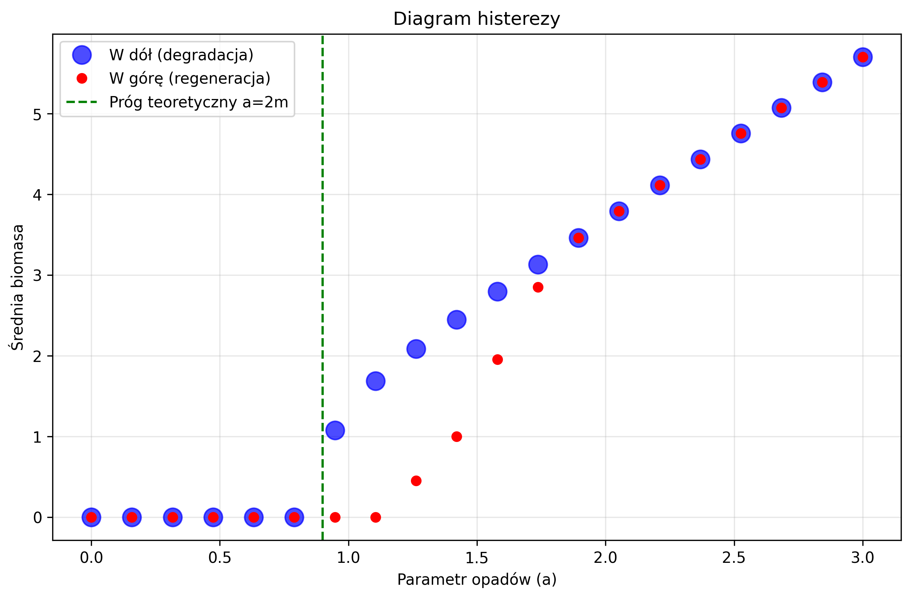
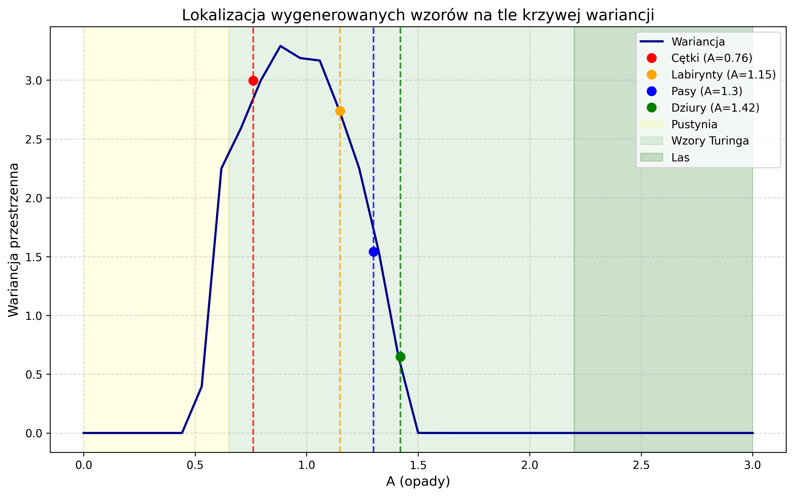

# Projekt z praktycznych zastosowań równań reakcji-dyfuzji 

# Analiza stabilności i samoorganizacji roślinności: model Klausmeiera

Projekt bada dynamiczne procesy powstawania wzorów roślinności w ekosystemach półpustynnych przy użyciu modelu reakcji-dyfuzji.

## Struktura projektu
* `notebooks/` - notatniki Jupyter z analizami i wykresami.
* `pipeline/` - skrypty python (funkcje pomocnicze).
* `data/` - dane z symulacji w formacie .csv oraz wygenerowane wykresy

## Kluczowe etapy analizy

### 1. Diagram bifurkacji i histereza
Wyznaczono teoretyczny próg przeżycia roślin $a = 0.9$. Symulacje numeryczne potwierdziły zjawisko histerezy – proces odradzania się roślinności wymaga znacznie wyższych opadów niż jej utrzymanie.

### 2. Formowanie wzorów (niestabilność Turinga)
W modelu zaobserwowano spontaniczne powstawanie struktur przestrzennych. W zależności od parametru opadów $a$, roślinność przybiera formy:
* cętki
* labirynty
* pasy
* dziury

### 3. Sygnały Wczesnego Ostrzegania
Analiza wariancji przestrzennej wykazała gwałtowny wzrost fluktuacji przed osiągnięciem punktu krytycznego (pustynnienia), co stanowi wskaźnik ostrzegawczy dla ekosystemu.

## Metodologia
* **Solver:** Metoda ADI (Alternating Direction Implicit).
* **Język:** python (NumPy, Matplotlib).
* **Weryfikacja:** Przeprowadzono analizę zbieżności czasowej oraz wpływ rozmiaru domeny na stabilność wyników ($\mu_v$, $\zeta_v$).

## Wnioski Końcowe
1. **Istnienie punktów krytycznych**: Model potwierdził, że ekosystemy półpustynne są narażone na gwałtowne zmiany stanu, których nie da się łatwo cofnąć ze względu na efekt histerezy.
2. **Samoorganizacja jako mechanizm przetrwania**: Powstawanie wzorów (cętek, pasów) nie jest przypadkowe – to sposób, w jaki roślinność optymalizuje dostęp do deficytowej wody.
3. **Wartość predykcyjna**: Wzrost wariancji przestrzennej oraz zmiany w strukturze wzorów mogą służyć jako wczesny system ostrzegania przed pustynnieniem w rzeczywistych ekosystemach.
